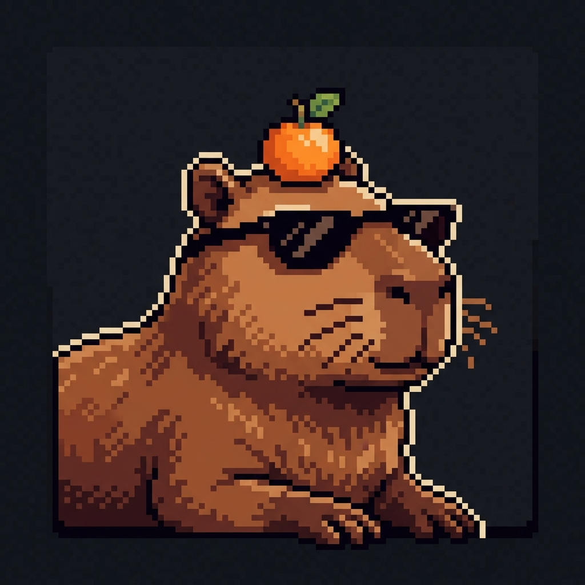

# 🍊 CapybaraPR

### *High-Performance Game Development & Server Frameworks for SCP: Secret Laboratory*

  
  
  

---

### 📖 О студии

**CapybaraPR** — независимая студия разработки высокопроизводительных игровых фреймворков, сетевых механик и серверных экосистем для **SCP: Secret Laboratory (EXILED)**.

Мы создаем передовые решения для мультиплеера: от низкоуровневой сетевой подмены пакетов (Mirror HLAPI) и кастомного контента до безопасных Discord-мостов с криптографической аутентификацией.

---

### 🎮 Наши игровые серверы

| Сервер | Режим | Описание |
| :--- | :--- | :--- |
| ⚡ **NoRules (NR)** | *Classic NoRules* | Динамичный геймплей без жестких ограничений, оптимизированный сетевой код, кастомные предметы и роли. |
| 🎭 **MediumRP (MRP)** | *Roleplay* | Атмосферный ролевой сервер с глубоким погружением, проработанными фракциями и кастомным интерфейсом. |

---

### 🛠️ Наши ключевые проекты

* 🍊 [**CapyLib**](https://github.com/CapybaraPR/CapyLib) — флагманский фреймворк и модульная библиотека:
  * 🧠 **`Capy.Core`**: модульный DAG-загрузчик с зависимостями `[DependsOn]`, встроенный IoC/DI контейнер, шина событий `EventBus`, базы данных (LiteDB / MongoDB) и аппаратная защита DRM.
  * 🔮 **`Capy.Engine`**: подсистема `FakeSync` (Mirror HLAPI сетевая иллюзия), фреймворк кастомных предметов (`CustomItem`), ролей (`CustomRole`), 3D-звук и HUD.
  * 🌐 **`Capy.API`**: защищенный REST-мост с проверкой цифровой подписи по **SSH RSA ключам** и защитой от Replay-атак.
* 🤖 [**CapyLib.DiscordBot**](https://github.com/CapybaraPR/CapyLib.DiscordBot) — многосерверный Discord-бот:
  * Удаленное управление серверами через Slash-команды (`/server`, `/players`, `/command`).
  * Раздельное логирование 5 категорий событий (Наказания, Раунды, Сервер, Команды, Жалобы).
  * Интеграция привязки игровых аккаунтов (`/steamsl` и `.linkdiscord`) и авто-синхронизация ролей в реальном времени.

---

### 💻 Стек технологий

* **Языки и платформы**: C# (latest), .NET 8 / 10 / .NET Framework 4.8
* **Игровой движок & Сеть**: Unity 2021+, Mirror Networking (HLAPI), EXILED Framework, ProjectMER
* **Безопасность и криптография**: OpenSSH RSA-SHA256, SHA-256 Request Integrity, Anti-Replay Timestamp Protection
* **Базы данных и хранилища**: LiteDB (NoSQL Embedded), MongoDB, YAML / JSON

---

### 🍊 Присоединяйтесь к нашему сообществу

 

© 2026 CapybaraPR. All rights reserved.

